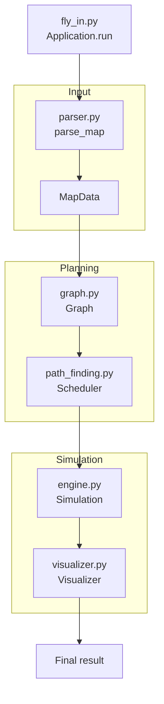

*This project has been created as part of the 42 curriculum by adedias-*

# Fly-in Drones

## Description

This project simulates the movement of drones across a network of connected zones. The goal is to deliver every drone from the starting zone to the destination zone while respecting capacity constraints, movement costs, and scheduling conflicts.

The program reads a map file, validates the scenario, builds a graph of zones and connections, plans movement routes, and executes the simulation turn by turn.

## Instructions

### Requirements

The project must follow the constraints described in `subject`:

- Python 3.10 or later;
- code must comply with flake8;
- type hints must be used whenever applicable;
- static validation must be done with mypy;
- exceptions must be handled cleanly;
- graph libraries such as `networkx` or `graphlib` are forbidden;
- the project must be fully object-oriented;
- a Makefile must provide `install`, `run`, `debug`, `clean`, and `lint` targets;
- tests should cover edge cases;
- `.gitignore` must ignore Python artifacts;
- a virtual environment is recommended.

### Build and execution

```bash
python3 -m venv .venv
source .venv/bin/activate
make install
make run
```

To run the main program with a specific map:

```bash
python fly_in.py maps/easy/01_linear_path.txt
```

To enable detailed visual output:

```bash
python fly_in.py maps/medium/01_dead_end_trap.txt --visual
```

## Algorithm and implementation strategy

The program is structured around a clear pipeline:

1. Parsing: the map file is parsed and validated to ensure that zones, connections, and capacities are well-formed.
2. Graph construction: a custom graph is created from the parsed map without using external graph libraries.
3. Route planning: the scheduler evaluates possible moves while considering path length, zone penalties, and capacity constraints.
4. Simulation: each drone moves one turn at a time, with simultaneous updates and conflict checks.
5. Visualization: the terminal output highlights drone movements and the current state of the simulation.

This approach keeps the logic modular and allows the simulation to handle multiple drones, waiting states, restricted zones, and conflict avoidance in a controlled and readable way.

## Visual representation

The project includes a visual layer that helps users understand the execution of the simulation in real time. The visualizer outputs movement lines in the required format and supports colorized terminal output for zones and drone states.

This improves readability because the user can follow which drones move, which zones they enter, and whether a route is blocked by capacity or turn timing constraints.

## Input format and example

Each map file contains:

- `nb_drones: <number>`;
- `start_hub: <name> <x> <y> [metadata]`;
- `end_hub: <name> <x> <y> [metadata]`;
- `hub: <name> <x> <y> [metadata]`;
- `connection: <zone1>-<zone2> [metadata]`.

Example input:

```text
nb_drones: 5
start_hub: hub 0 0 [color=green]
end_hub: goal 10 10 [color=yellow]
hub: roof1 3 4 [zone=restricted color=red]
hub: roof2 6 2 [zone=normal color=blue]
hub: corridorA 4 3 [zone=priority color=green max_drones=2]
hub: tunnelB 7 4 [zone=normal color=red]
hub: obstacleX 5 5 [zone=blocked color=gray]
connection: hub-roof1
connection: hub-corridorA
connection: roof1-roof2
connection: roof2-goal
connection: corridorA-tunnelB [max_link_capacity=2]
connection: tunnelB-goal
```

Example expected output:

```text
D1-roof1 D2-corridorA
D1-roof2 D2-tunnelB
D1-goal D2-goal
```

## Zone rules

- `normal`: cost is 1 turn;
- `restricted`: cost is 2 turns;
- `priority`: cost is 1 turn and should be preferred by the planner;
- `blocked`: not traversable.

All capacities are checked against movement rules. A drone cannot enter a zone or cross a connection if it would exceed the permitted capacity in the same turn.

## Performance and optimization targets

The main evaluation target is not only correctness, but also efficiency. The project is scored against optimal turn counts for each benchmark map. Correctness is mandatory; turn count is reported separately and used to estimate how close the implementation is to the optimum.

The shipped maps include the following optimal targets:

- Easy maps: 4 turns, 4 turns, 4 turns;
- Medium maps: 8 turns, 10 turns, 6 turns;
- Hard maps: 13 turns, 16 turns, 26 turns;
- Optional challenger map: 43 turns.

## Functional flow of the project



## Resources

### External references

- Graph theory and pathfinding basics: BFS, shortest path, and graph traversal concepts;
- Python documentation for type hints, dataclasses, and standard libraries;
- terminal visualization examples for colored output and structured logging;
- general project design principles for object-oriented simulation and scheduling.

### AI usage

AI tools were used to help with:

- understanding the project requirements from the specification;
- reviewing the project structure and identifying the separation between parsing, graph logic, scheduling, simulation, and visualization;
- drafting the project documentation and clarifying technical choices.

No AI-generated logic was used as a substitute for the actual project implementation; the final design and code were validated against the project rules and repository behavior.

## Project structure

- `fly_in.py`: main application entry point;
- `engine.py`: simulation engine and turn logic;
- `graph.py`: graph logic and connectivity checks;
- `models.py`: zone, connection, and drone models;
- `parser.py`: map parser and input validation;
- `path_finding.py`: route planning and scheduling;
- `visualizer.py`: terminal-based visualization;
- `maps/`: map examples for testing;
- `Makefile`: project automation commands.

## Summary

Fly-in Drones is a Python-based simulation project that combines parsing, graph traversal, scheduling, and visualization into a single object-oriented system. The objective is to move all drones from the start to the finish while respecting all movement constraints, zone capacities, and connection limits in the most efficient way possible.
